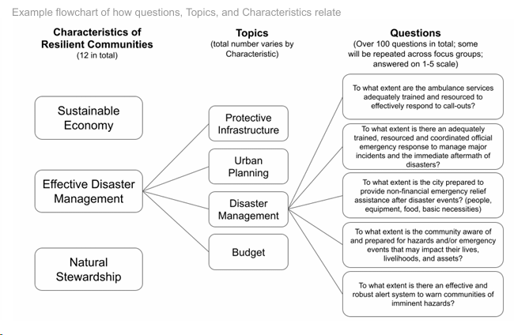

# CS481 Capstone Project

## Rural Resilience Dashboard

### Overview
 The Hazard and Climate Resilience Institute designs and conducts cross-sector community
 resilience assessments for rural communities. Comprehensive resilience assessments play a
 vital role in helping communities understand risks and hazards, implement mitigation strategies,
 and recover/plan for the future. Rural communities face unique challenges, given their
 geographic isolation, limited resources, and other barriers. We initially adapted the City
 Resilience Index to meet these unique rural conditions, but the project has since undergone
 enough modification to be a new framework. As we’ve moved away from the City Resilience
 Index, we need a better interface to populate specific qualitative questions sets and create data
 visualizations based on question results. By collaborating with Boise State students on this
 website/dashboard/portal, we can streamline the processes of data collection and
 representation. This will directly increase the positive impact of our resilience assessments–it
 will help us connect with more rural communities and quickly communicate our assessment
 findings.
 
 The product that we envision is a dashboard that includes the following parts/functions:
 1. Unique profile for each community being assessed
 2. Complete question bank, from which we can easily populate specific questions based on
 relevance to the community
 3. Ability to input data (questions answered on a 1-5 scale)
 4. Ability to create data visualizations for question results (multiple question scores are
 combined to give an overall score for each “Topic.” Multiple “Topic” scores are combined
 to give an overall score for each “Characteristic of Resilient Communities.”)
    - Data visualization for individual Characteristics, broken up by Topic.
    - Data visualization for all Characteristics of Resilient Communities at once.



### Project Status
[]

### Virtual Local Enviornement Setup
- Prerequisite: install `virtualenv` and `python` version 3.8 or newer

[Installation Link](https://virtualenv.pypa.io/en/latest/installation.html)

1. `cd` into the project `src/` directory
    - Verify correct directory
```bash
$ pwd
s25-horde/src

$ ls
backend 
```

2. **Create the environment (creates a folder in your current directory)**
    - **NOTE**: Do not change the `env_name` (use `venv` as specified)
```bash
$ virtualenv venv or python -m venv venv
```
- Verify the directory for the virtual enviornment was created
```bash
$ ls
backend venv
```

3. **In Linux or Mac, activate the new python environment**
```bash
$ source venv/bin/activate
```
**Or in Windows**
```bash
.\env_name\Scripts\activate
```
 - **NOTE**: A change in the terminal (enviornment name) will be seen indicating succesful activation.
```bash
(venv) user@ubuntu:src $ 
```

4. **Confirm that the enviornment is successfully selected**
```bash
$ which python
~/s25-horde/src/venv/bin/python
```

5. **Deactivate the virtual enviornment when desired**
```bash
$ deactivate
```
 - **NOTE**: A change in the terminal will be seen indicating succesful deactivation. `(venv)` no longer seen in the beginning of the prompt.
```bash
user@ubuntu:src $ 
```

### Now Ready to Install Dependencies
- **NOTE:** First `cd` into the top level directory of the project. Should see the following list of files and directories if in the correct directory.
```bash
$ ls
build.sh  CONTRIBUTORS  implementation.txt  README.md         src
clean.sh  docs          LICENSE             requirements.txt  test.sh
```
- The requirements.txt contains the list of packages or dependencies need for the Django project.
**List of Dependencies:**
    - django
    - djangorestframework
    - django-cors-headers

- This packages are installed via `pip`
```bash
$ pip3 install -r requirements.txt or pip install -r requirements.txt
```

- **Installation of the packages is successful if the following are installed:**
```bash
(venv) username@ubuntu:src$ pip list
Package             Version
------------------- -------
asgiref             3.8.1
Django              5.1.6
django-cors-headers 4.7.0
djangorestframework 3.15.2
pip                 23.2.1
sqlparse            0.5.3
```

**NOTE:** Django Project can now be ran

### How to Run Django Project
1. `cd` into project directory containing the `manage.py` file. Use `ls` to verify the correct directory.
```bash
$ ls
manage.py  rrd  RuralResilienceDashboard
```
2. Python server can with the `manage.py` file
```bash
$ python manage.py runserver
```

## Podman Tutorial

**Podman** is the the tool used for containerization. Below are versions
used in this project.

**IMPORTANT**: Any older version may not be support and was found to cause
issues with building and starting the containers. **Recommended** to use
the versions below or newer.
```bash
$ podman-compose --version
podman-compose version 1.3.0
podman version 5.4.2
```

### Podman Common Commands
```bash
podman images                                       # List images in local storage
podman ps -a                                        # List all the containers (Running and Stopped)
podman rm <CONTAINER_ID> or <NAME>                  # Remove a container via the id or name
podman rm -a                                        # Removes all stopped containers
podman rmi <IMAGE_ID>                               # Removes an image via the image ID
podman image prune                                  # Remove all images not in use by a running container
podman inspect <CONTAINER_ID> or <NAME>             # Display the configuration of object denoted by ID (useful for container status)
podman build ./path/...                             # Build an image from a containerfile (must specify the path to containerfile from current directory)
podman build -t <image_name> ./path/...             # Builds and assigns name to the image
podman run <image_name> or <image_id>               # Runs the image
podman run -it <image> /bin/bash                    # Runs a bash specified interactive (-i) pseudo-terminal (-t)
podman run -it --rm <image> /bin/sh                 # Automatically removes the container after exiting
podman run -p <hostport>:<containerport> <container>      
podman run -d <container> /bin/bash                 # Runs container in the background
podman logs <container>                             # Checks logs of a container
podman exec -it <container_id_or_name> /bin/bash    # Interact with the container without restarting it
podman-compose build                                # Rebuilds the image for changes made in Dockerfile or docker-compose.yml
podman-compose up -d                                # Builds and runs Django
podman-compose down                                 # Stops and removes the container
podman pod ps -a                                    # List all pods (stopped and running)
podman pod stop                                     # Stops a running pod
```

## Docker Commands
```bash
sudo systemclt status docker        # checks the status docker, inactive (dead) or active (running)
sudo systemclt start docker         # starts a docker daemon, sets the docker status to active (running)
sudo systemclt stop docker          # starts a docker daemon, sets the docker status to inactive (dead)
sudo systemctl restart docker       # restarts a docker daemon
```

## Image Setup

## Container Building and Testing
**NOTE:** Requires a Containerfile/Dockerfile
**1. Build an image from the Dockerfile**
```bash
$ podman build -t my-django .
```
If build was successful, verify the creation of the image
```bash
$ podman images
REPOSITORY                TAG         IMAGE ID      CREATED        SIZE
localhost/my-django       latest      5c1e80f501f9  8 seconds ago  247 MB
```
**2. Run a container in the background**
```bash
$ podman run -d -p 8000:8000 --name django-container my-django:latest
```
**3. Verify the container is running**
```bash
$ podman ps -a
CONTAINER ID  IMAGE                       COMMAND        CREATED        STATUS        PORTS                   NAMES
15d9c19cfa92  localhost/my-django:latest  /app/start.sh  3 seconds ago  Up 4 seconds  0.0.0.0:8000->8000/tcp  django-container
```
View container logs to verify Django project is running. 
A successful run will look like the below.
```bash
$ podman logs django-container 
Starting Django development server...
Watching for file changes with StatReloader
Performing system checks...

System check identified no issues (0 silenced).

You have 18 unapplied migration(s). Your project may not work properly until you apply the migrations for app(s): admin, auth, contenttypes, sessions.
Run 'python manage.py migrate' to apply them.
March 02, 2025 - 08:42:23
Django version 4.2.19, using settings 'rrd.settings'
Starting development server at http://127.0.0.1:8000/
Quit the server with CONTROL-C.

```
Additionally can test with `curl`
```bash
$ curl http://localhost:8000/ or http://127.0.0.1:8000/
```

Finally, test in a browser
```bash
$ http://localhost:8000/ or http://127.0.0.1:8000/
```

**Additional Tips:**
- container runs server on port `8111` found in the `start.sh` script.
- `podman run -d -p <hostport>:<container_port> --name my-django-container my-django`. The option `-p` will map a host port to the container port. The host port is used to access the server.
**Example**
`-p 8100:8111`, host port `8100` is mapped to set container port `8111`. Thus, the Django project can be accessed from the browser from `http://127.0.0.1:8100/`.

## Custom Ports and Port Setting
Requires a `.env` file to set custom enviornment variables.
The `docker-compose` file supports custom host port setting via the 
`HOST_PORT` enviornment variable. If `HOST_PORT` is not set, then uses
the default host port number `8101`.

#### How to set enviornment variables
1. Create a `.env` file in the top directory of the project.
2. Define and Set enviornment variables. Examples below.

**Example**: set `HOST_PORT` enviornment variable in `.env` file
```bash
HOST_PORT = 8888
# access Django web application via, http://localhost:8888/
```
3. Alternatively can set the `HOST_PORT` inline without a `.env` file.

**Example**
```bash
HOST_PORT=9000 podman-compose up -d
```

**Example**: set `APP_ROOT` enviornment variable in `.env` file
```bash
APP_ROOT = "s25-horde"
# access Django web application via, http://localhost:8888/s25-horde
```

## Tailwind Installation and Usage
--------------------------------------

[Official Nodejs Documentation](https://nodejs.org/en)
- **NOTE:** Requires `Node.js` to be installed on local machines.

### Django Setup for Tailwind
[Official Installation Documentaion](https://django-tailwind.readthedocs.io/en/latest/installation.html)
- This project was setup using the installation guide detailed in the official 
documentation for `django-tailwind`.

### How to use Tailwind CSS in Django
To use Tailwind CSS classes in HTML, the TailWind CSS service must be started.
Start the development server by running the following command in the terminal:
```bash
python manage.py tailwind start
```

**IMPORTANT:** The Tailwind CSS service is handled in the containerization files
and process. No manual start of any service is required for this project.

## Database Setup and Usage (PostgreSQL)
By default, the `DATABASES` configuration in `settings.py` uses
**SQLite**. SQLite is included in Python, so no installation is needed
to support this database. However, SQLite is not suitable for
scalable projects thus **PostgreSQL** will be used instead.

### PostgreSQL Local Machine Installation
Since, the default database **SQLite** will not be used. An 
installation process will be required for other database services.

1. **Installation**
    - The official PostgreSQL guide below can be used for a detailed step-by-step
installation for each distribution and operation system.
[Official PostgreSQL Download Guide](https://www.postgresql.org/download/)

    - **PostgreSQL** has a GUI application named **pgAdmin**. This application
is **_optional_** (not required for Django) as a user-friendly approach to connect
and modify schemas in a PostgreSQL database.
[Official pgAdmin Download Guid](https://www.pgadmin.org/download/)

2. **Django Setup and Configuration**
    - The Django project was configured using the official Django PostgreSQL notes
below. This guide details the configuration needed for external databases 
like PostgreSQL to be used in a Django project.
[Official Django PostgreSQL Configuration Guide](https://docs.djangoproject.com/en/5.1/ref/databases/#postgresql-notes)

### Common Usage for PostgreSQL
After successful installation, check the database version.
```bash
$ psql --version
psql (PostgreSQL) 16.8
```

#### How to check the status of the PostgreSQL database
```bash
$ systemctl status postgresql.service
# This status shows the database service is currently not running
Active: inactive (dead)
# This status shows the database service is currently running
Active: active (running)
```

#### How to Start, Stop, and Boot the PostgreSQL database
- Requires super user privileges (`sudo`) to perform any action for the database.

1. **Starting the PostgreSQL Database Service**
```bash
# Manually startup the database service
$ sudo systemctl start postgresql.service
```

2. **Stop the PostgreSQL Database Service**
```bash
# Manually shutdown the database service
$ sudo systemctl stop postgresql.serivce
```

3. **Enable PostgreSQL to Run on Boot** (optional)
    - By default, the `postgresql` service does not running on start up automatically. 
    This functionallity can be changed if desired as shown below.

```bash
# Enables the postgres service to run automatically on system startup
$ sudo systemctl enable postgresql
```
#### How to Interact with PostgreSQL
- The below command runs from a `postgres` user on the system and enters the 
PostgreSQL prompt using the command `psql`. In other word, the below command
enters the PostgreSQL prompt with `psql` as the defined user (`-u`) named
`postgres`. In the terminal output, the left side shows the user.
```bash
# Runs from a 'postgres' system user and 'psql' enters the PostgreSQL prompt
$ sudo -u postgres psql

# Terminal Output
psql (16.8)
Type "help" for help.

postgres=# 
```

### Common PostgreSQL Prompt Commands
```bash
postgre=# \q                # exits the prompt
```

- The below command runs an interactive shell (`-i`) as the specified user
(`-u`) named `postgres`. Enter the PostgreSQL prompt from the interactive
shell using the command `psql`. Below shows the example command and output.
```bash
user@fedora:~$ sudo -i -u postgres
postgres@fedora:~$ psql
psql (16.8)
Type "help" for help.

postgres=# 
```

### How To Connect and Test Database
**Podman** containers automate the PostgreSQL database and the Django server.
Automating through containers comes with challeges that must be noted.

#### How to Test Database Connection
A `.env` files is used to setup and privately authenticate connections to
the PostgreSQL database. The necessary enviornment variables needed are
found in the `docker-compose.yml` file and `settings.py`. These require
the enviornment variables to be set in a `.env` file. Below is an example
of the enviornment variables needed to connect to PostgreSQL.

**NOTE:** May also need to setup a `.env.local` for local testing.

`.env` file:
```bash
# Database (PostgreSQL) credentials
POSTGRES_USER=djangocs481admin
POSTGRES_PASSWORD=Djangocs481password
POSTGRES_DB=djangocs481db

# Database connection for Django
DB_HOST=db # For Django (inside container), NOT for pgAdmin
```

`.env.local` file:
```bash
DB_HOST=localhost
DB_PORT=55432
POSTGRES_DB=djangocs481db
POSTGRES_USER=djangocs481admin
POSTGRES_PASSWORD=Djangocs481password
```

The PostgreSQL GUI application `pgAdmin` or `psql` in the terminal
can be used to test the connection of the database. 
- **NOTE:** Make sure the containers are running before
testing the connection
```bash
# first check if containers are running
$ podman ps -a
CONTAINER ID  IMAGE                              COMMAND               CREATED        STATUS        PORTS                    NAMES
6b76490b597e  docker.io/library/postgres:latest  postgres              8 minutes ago  Up 8 minutes  0.0.0.0:55432->5432/tcp  postgres-container
680ae74a3f2d  localhost/my-django:latest         /bin/sh -c /bin/s...  8 minutes ago  Up 8 minutes  0.0.0.0:8101->8100/tcp   django-container
```

```bash 
# use credentials to connect to database via psql
psql -h localhost -p 55432 -U djangocs481admin -d djangocs481db
Password for user djangocs481admin: 
```

### Container Workaround for Common Issues
As the project is automated through containers, commands 
must be executed within the containers to properly run
and ensure functionallity. Below are a list of common 
issues and workaround solutions.

**1.** Super users can not be created in the traditional way. When Django
runs inside of a container, the hostname defined works because
Docker/Podman Compose creates a network where the containers can
talk to each other by service name. However, this does not work
from the **host terminal on your local machine**. For example,
if the `compose.yml` file defines the PostgreSQL hostname to be
`db` then you will running into the issue below.
```bash
# local host terminal session
$ python manage.py createsuperuser
...
...
 django.db.utils.OperationalError: could not translate host name "db" to address: Name or service not known
```
- This error occurs because Django is trying to connect to a PostgreSQL host named db, but your local terminal environment doesn't know what db means.

#### How to Fix Creating `superuser`
##### 1. Temporarily override `DB_HOST` when running locally
```bash
DB_HOST=localhost python manage.py createsuperuser

# If you're exposing PostgreSQL on host port 55432
DB_HOST=localhost DB_PORT=55432 python manage.py createsuperuser
```

##### 2. Use `podman exec` to run it inside the container
Enter an interactive shell or run commands from the interactive
shell of the container. This is useful in production-styled 
enviornments. The container name can be found under the web 
services in the `docker-compose.yml` file.
```bash
# podman exec -it django-container python /app/src/backend/rrd/manage.py createsuperuser
podman exec -it <container_name> python /app/src/backend/rrd/manage.py createsuperuser
```
- This runs the command inside the Django container, so DB_HOST=db works as expected.

### How to Create Models (Write Querys)
**NOTE:** First start up the container (use `./composer-start.sh`).
Ensure the containers are running. Now models can be actively
written to the project.

Follow the steps below to properly create, manage, and update
models (database schemas) from the Django project.

**1.** After a model is created or updated run `makemigrations`
to tell Django some changes have been made to the models 
and the changes should be stored as a **_migration_**.
```bash
# Execute makemigrations command within the container
$ podman exec -it django-container python /app/src/backend/rrd/manage.py makemigrations dashboard

# Sample Output
Migrations for 'dashboard':
  src/backend/rrd/RuralResilienceDashboard/migrations/0001_initial.py
    - Create model Testing
```

**2.** Before running the migrations to manage the database schema 
automatically, it is important to verify the migrations runs
the correct SQL instructions. The `sqlmigrate` command takes migration
names and return their SQL.
```bash
# Execute sqlmigrate command within the container
$ podman exec -it django-container python /app/src/backend/rrd/manage.py sqlmigrate dashboard 0001

# Sample Output
BEGIN;
--
-- Create model Testing
--
CREATE TABLE "dashboard_testing" ("id" bigint NOT NULL PRIMARY KEY GENERATED BY DEFAULT AS IDENTITY, "question_text" varchar(200) NOT NULL, "pub_date" timestamp with time zone NOT NULL);
COMMIT;
```

**3.** Additionally a `check` can be performed to check for any problems 
within the project withou making migrations or touching the database.
```bash
$ podman exec -it django-container python /app/src/backend/rrd/manage.py check
System check identified no issues (0 silenced).
```

**4.** Once the SQL instructions are confirmed, the `migrate` command 
is ready to be ran. The `migrate` command takes all the migrations that haven’t been applied (Django tracks which ones are applied using a special table in your database called django_migrations) and runs them against your database - essentially, synchronizing the changes you made to your models with the schema in the database.
```bash
$ podman exec -it django-container python /app/src/backend/rrd/manage.py migrate
Operations to perform:
  Apply all migrations: admin, auth, contenttypes, dashboard, sessions
Running migrations:
  Applying dashboard.0001_initial... OK
```

### The Three Steps to Updating Database Live
1. Change in models (in `models.py`).
2. Run `python manage.py makemigrations` to create migrations for those changes.
3. Run `python manage.py migrate` to apply those changes to the database.

## Error Handling and Logs
A `logs` directory can be found in the `rrd` project directory. This 
directory contains a logs of errors produced. These logs provide
further detail about the errors. Below is the complete directory
path to the logs files.
```bash
src/backend/rrd/logs/django_errors.log
```
This log file generally stores the error output that can only be seen
within the container enviornment (e.g. via interactive shell, etc). 
This file is generally helpful for frontend debugging and logging.
Most frontend errors will show below will be captured by this 
log file. Currently, it doesn't provide much help or support for
the backend (postgreSQL database).

**Common log errors:**
- Bad settings (like missing or incorrect INSTALLED_APPS entries).
- Problems in URL patterns.
- Template syntax issues. 

## Windows Container Issues
**NOTE:** Containers are more throughly tested in a **Linux** enviornment.
It possible to run this project through native **Windows** enviornment
,however developers may run into unique issues that only occurs 
from a Windows enviornment. **Windows Subsytem for Linux** (`WSL`) 
struggles the most to run containers and is **not recommend** for 
development.

It is recommended Windows System Users install `dos2unix` to 
prevent issues with file formatting. This install hopes to ensure 
consistency between different operating systems, especially between
shell script files `(*.sh)` and general text files `(.txt)`. 
Additionally, a `.gitattributes` files is included in the 
root directory of the git project. Currently this file forces Git to
convert shell script files to Unix-style line endings `(LF)`.  

______________________

## Project Testing
**NOTE:** Most testing was done in a **Linux** enviornment.
Modifications made to `manage.py` to and added a `.env.local` file
to support local testing.

Automatic testing is enabled for this project. Commits are tested with
the `Git Actions` workflow defined in `workflows/ci.yml` file. The
test ran is defined in the `test.sh` script.

### How the Test Script (`test.sh`) Works
There are **two** Django specific commands that are used for testing. These
commands are used to run a system check framework that analyzes the 
project common errors/potential issues and perform unit testing.
The `test.sh` script in the top level project directory runs the
**two** Django commands for testing. Below further details these commands.

### Commands for Django Testing
**The Two Django Testing Commands:**
- `python manage.py check`
- `python manage.py test`

**1.** `check` command
The `python manage.py check` command is apart of the Django framework.
This command **runs a system check framework** that **analyzes the project
for common errors and potential issues** without actually running the
server or applying migrations.

**Specifically, `check` will:**

- Inspect your **models, settings, URLs, templates, and middleware** for **configuration mistakes**.

- Report things like:
    - Missing fields or misconfigured models.
    - Bad settings (like missing or incorrect INSTALLED_APPS entries).
    - Problems in URL patterns.
    - Deprecation warnings.
    - Template syntax issues (basic ones — it won't fully render templates).

- It does not:
    - Make any changes.
    - Interact with the database (no migrations, no queries).
    - Start the development server.

**When to use it?**
- After making changes to your models or `settings.py`.
- Before deploying to production.
- As part of a CI/CD pipeline to catch errors early.

**Additionally:**
The `--deploy` options can be ran with the `check` command
(e.g. `check --deploy`) for **more detailed checks**. This
gives **extra warnings** useful for **production settings**
(e.g., missing `SECURE_SSL_REDIRECT`, missing `ALLOWED_HOSTS`, etc.).

**Example:**
```bash
$ python manage.py check
System check identified no issues (0 silenced).
```

```bash
$ python manage.py check --deploy
System check identified some issues:

WARNINGS:
?: (security.W004) You have not set a value for the SECURE_HSTS_SECONDS setting. If your entire site is served only over SSL, you may want to consider setting a value and enabling HTTP Strict Transport Security. Be sure to read the documentation first; enabling HSTS carelessly can cause serious, irreversible problems.
?: (security.W008) Your SECURE_SSL_REDIRECT setting is not set to True. Unless your site should be available over both SSL and non-SSL connections, you may want to either set this setting True or configure a load balancer or reverse-proxy server to redirect all connections to HTTPS.
?: (security.W009) Your SECRET_KEY has less than 50 characters, less than 5 unique characters, or it's prefixed with 'django-insecure-' indicating that it was generated automatically by Django. Please generate a long and random value, otherwise many of Django's security-critical features will be vulnerable to attack.
?: (security.W012) SESSION_COOKIE_SECURE is not set to True. Using a secure-only session cookie makes it more difficult for network traffic sniffers to hijack user sessions.
?: (security.W016) You have 'django.middleware.csrf.CsrfViewMiddleware' in your MIDDLEWARE, but you have not set CSRF_COOKIE_SECURE to True. Using a secure-only CSRF cookie makes it more difficult for network traffic sniffers to steal the CSRF token.
?: (security.W018) You should not have DEBUG set to True in deployment.

System check identified 6 issues (0 silenced).

```

**2.** `Test` command

____________________

## Building Project Steps and Deployment

**IMPORTANT:** Must have **Podman** installed before using Project Build Steps.
Deployment is handled through **Podman** containers. **Docker** files and composers
are used for the **Podman** containers, thus alternatively **Docker** can 
be used instead. However, no **Docker** steps are provided in this project.

**NOTE:** Steps 1 and 2 are optional steps for user setup. Steps 4 and on are required for container building. Scripts are developed in `Linux` enviornment
so it is recommend to use these steps for a Linux enviornment.

1. Run the `setup.sh` script to setup an optional python virtual enviornment (**RECOMMENDED**).
```bash
$ ./setup.sh
```

2. Run the `activate.sh` script to activate the python virtual enviornment created.
```bash
$ source ./activate.sh
```

3. Assuming the enviornment has Python installed considering the previous steps were followed, install the necessary dependencies defined in the `requirements.txt` file using the `build.sh` script.
```bash
$ ./build.sh
```

4. Setup the **Podman** containers locally. This script executes the commands
described in the **Podman** setup section.
```bash
$ ./build-image.sh
```

5. With **Podman** setup and the project built, the containers can used to 
deploy the Django web application. See **Podman** section for further details
about how deployment works with **Podman**.
```bash
$ ./composer-start.sh
```

6. Clean the enviornment and shutdown the container
```bash
$ ./clean.sh
```

## Summary

### Tech Stack
This project includes the following tech components:
- HTML (Structure Web Pages)
- HTMX (Dynamic behavior, handling client-server communication)
- Tailwind CSS (CSS Framework without writing CSS)
- PostgreSQL (Scalable and Fully supported by Django)

#### Frontend
**HTML**
- **Purpose:** HTML is the foundational markup language used to structure the web pages in the application.
- **Usage in Project:** Each page is composed using Django templates (`.html` files) that dynamically render content based on server-side logic.
- **Why Chosen:** HTML is essential for any web-based application. Django's templating engine integrates seamlessly with HTML, making it the natural choice.

**HTMX**
- **Purpose:** HTMX is a lightweight JavaScript library that enables dynamic web page interactions without writing traditional JavaScript.
- **Usage in Project:** HTMX handles client-server communication for partial updates (such as form submissions, button clicks, or loading new page sections) without full page reloads.
- **Why Chosen:** HTMX keeps the frontend simple and powerful by avoiding heavy frontend frameworks like **React** or **Angular**, reducing complexity and development time while still providing dynamic behavior.

**Tailwind CSS**
- **Purpose:** Tailwind CSS is a utility-first CSS framework for rapidly building custom user interfaces.
- **Usage in Project:** Tailwind classes are used throughout the Django templates to style pages, including layouts, components, and responsive designs, without writing custom CSS files.
- **Why Chosen:** Tailwind allows for highly customizable and responsive design while minimizing the need to manage large CSS files, fitting the project's goal of maintaining lightweight and maintainable styling.

#### Backend
**PostgreSQL**
- **Purpose:** PostgreSQL is a powerful open-source relational database management system (RDBMS).
- **Usage in Project:** It serves as the primary database for storing all project data, including user inputs, assessments, survey results, and system metadata.
- **Why Chosen:** PostgreSQL is highly scalable, supports complex queries and transactions, scales well, and is fully supported by Django. It is an industry-standard choice for production-ready web applications.

## Additional Resources

#### GitHub Preferred Workflow
[Preferred Workflow Demo](https://www.youtube.com/watch?v=ZhDxeRz2Ins&list=WL&index=2)
